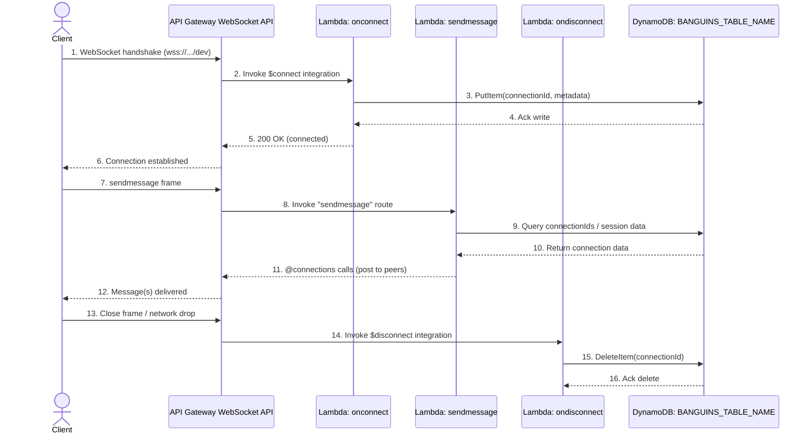

# Backend

## Infrastructure Outline



```
.
├── lambdas/onconnect                   <-- Source code onconnect
├── lambdas/ondisconnect                <-- Source code ondisconnect
└── lambdas/sendmessage                 <-- Source code sendmessage
```

`"resolveJsonModule": true "esModuleInterop": true` is added to `tsconfig.json` to support import jsonfile as header

## Build

To build this app, you need to be in this example's root folder. Then run the following:

```bash
npm install -g aws-cdk
npm install

```

This will install the necessary CDK, then this example's dependencies. TypeScript will be run when the cdk is synthesized.

## Deploy

For the first deploy, run:

```sh
npm run bootstrap
```

THen for subsequent deploys and deletions, run:

```sh
npm run deploy
npm run delete
```

After the deployment you will see the API's URL, which represents the url you can then use. Past URLs are:

- `wss://39mbb0jtq3.execute-api.us-east-1.amazonaws.com/dev`

## CloudFormation Templates

To see the Cloudformation template generated by the CDK, run:

```sh
npm run synth
```

Then check the output file in the "cdk.out" directory.

## Testing

To test the WebSocket API, you can use [wscat](https://github.com/websockets/wscat), an open-source command line tool.

1. [Install NPM](https://www.npmjs.com/get-npm).
2. Install wscat:

```bash
$ npm install -g wscat
```

3. On the console, connect to your published API endpoint by executing the following command:

```bash
$ wscat -c wss://{YOUR-API-ID}.execute-api.{YOUR-REGION}.amazonaws.com/{STAGE}
```

4. To test the sendMessage function, send a JSON message like the following example. The Lambda function sends it back using the callback URL:

```bash
$ wscat -c wss://{YOUR-API-ID}.execute-api.{YOUR-REGION}.amazonaws.com/prod
connected (press CTRL+C to quit)
> {"action":"sendmessage", "data":"hello world"}
< hello world
```
