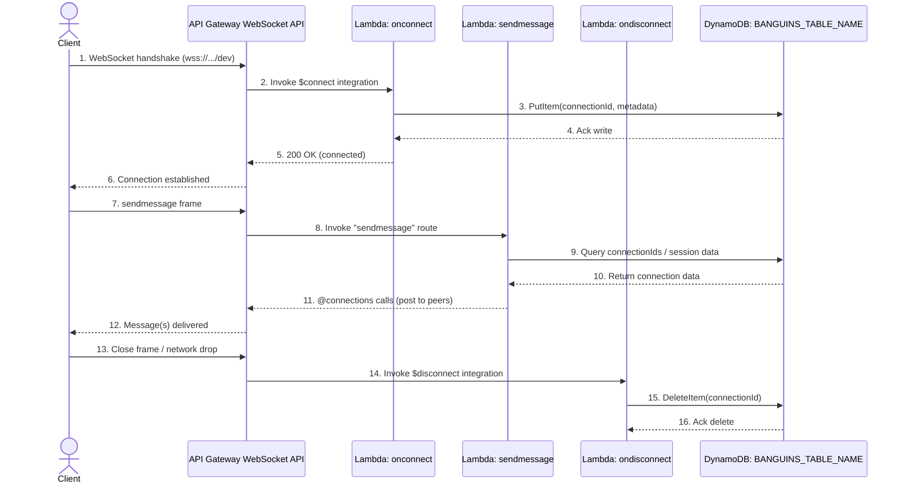

# Backend

## Infrastructure Outline



```
.
├── lambdas/onconnect                   <-- Source code onconnect
├── lambdas/ondisconnect                <-- Source code ondisconnect
└── lambdas/sendmessage                 <-- Source code sendmessage
```

`"resolveJsonModule": true "esModuleInterop": true` is added to `tsconfig.json` to support import jsonfile as header

## Build

To build this app, you need to be in this example's root folder. Then run the following:

```bash
npm install -g aws-cdk
npm install

```

This will install the necessary CDK, then this example's dependencies. TypeScript will be run when the cdk is synthesized.

## Deploy

For the first deploy, run:

```sh
npm run bootstrap
```

THen for subsequent deploys and deletions, run:

```sh
npm run deploy
npm run delete
```

After the deployment, the latest endpoint will be copied as a resource across the project.

## CloudFormation Templates

To see the Cloudformation template generated by the CDK, run:

```sh
npm run synth
```

Then check the output file in the "cdk.out" directory.

## Testing

### Local Server

Using AWS SAM CLI we can deploy and run the build locally:

```sh
npm run synth
npm run local
```

### Remote Testing

Run the `/admin` frontend application in the root of the repo. This provides various debug tools in a front end for validating the backend server is functioning as expected.
